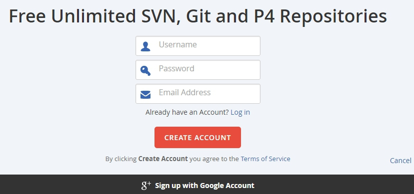
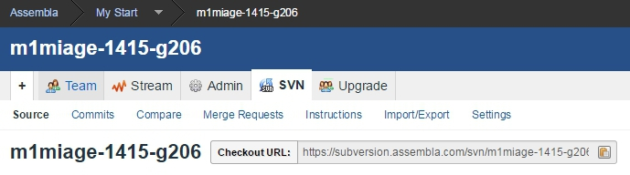

.. _AssemblaSection:

Assembla
========

Assembla_ is a hosting service in the cloud that support in particular
SVN and git repositories. In practice this is a good option to host SVN
repositories freely. Much more feature are available with paid plans.

.. figure:: media/AssemblaSplashScreen.jpg
    :align: center

Creating an account
-------------------
To get a free account use 'Pricing' and then click on the link
``Sign Up for a Free Plan`` that is on the page as shown below:

.. figure:: media/AssemblaSignInLink.jpg
    :align: center

You can sign up with a google account. Otherwise you will just need to a
few information: username, password, email, first name, last name.

Select add a SVN repository if this is what you want and give it a name.
That's all.

Adding collaborators to a repository
------------------------------------
To add collaborators to the repository click on the repository and then
select the ``Team`` tab. You just have to enter the email of each collaborator
and select their status for the selected repository:

* ``member`` for read/write access
* ``watcher`` for read access

Using a SVN repository
----------------------
SVN repositories are used remotely via SVN client. In order to do this
you must know the ``URI`` of the repository and give this URI to the client.
The URI can be found on the repository page in the ``SVN`` tab in the
``Checkout URL`` field as shown below.

...............................................................................

.. _Assembla: https://www.assembla.com

