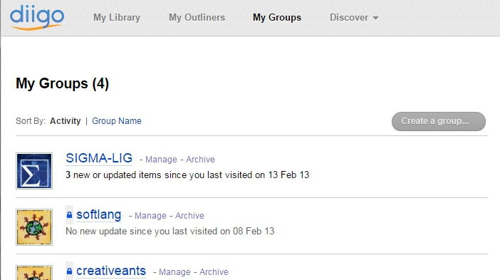

# coding=utf-8

.. _`Diigo chapter`:

Diigo
=====

Diigo_ is a collaborative bookmarking and annotation service on the cloud.

Features
--------

Diigo_ allows to:

* manage bookmarks (and store them in the cloud, not on your computers)
* create notes and create libraries of images from the web
* annotate any web pages and also pdf from the web
* create groups and share information (bookmarks, notes, annotations) among
  these groups
* generate rss feeds that are updated every time you publish a new link

Installation
------------

You have fist to `register to Diigo`_ and select the free plan. This will
give you access to the web interface of Diigo_.

    Diigo web interface for managing groups

To take the full profit of Diigo_ (and in particular to add annotations) you
should install a plugin for you favorite browser. You can either search
the web for with google ``diigo plugin chrome`` for instance or use the
`Diigo tools`_ page (use the Extension/Web Apps). Diigo_ is also available on
android and iphone.

.. figure:: media/diigo4chrome.jpg
    :align: center

    "Annotate & Capture the Web" in action, the plugin for Chrome

.. ............................................................................
.. _Diigo: https://www.diigo.com
.. _`register to Diigo`: https://www.diigo.com/sign-up
.. _`Diigo tools`: https://www.diigo.com/tools
