.. _`GanttProject chapter`:

GanttProject
============

`GanttProject`_ is a free `project management`_ tool allowing to *edit*
`gantt models`_ but also *view* `pert models`_ and `resource allocation models`_.
As this tools is written in java it runs on all platforms.

Features
--------

`GanttProject`_ allows to create *milestones* and hierarchies of *tasks*
related with *dependency constraints*. Different *fields* can be attached to
*milestones* and *tasks*. This includes for instance "priority", "cost", "start date",
"duration", etc. *Custom fields* can also be added.

.. figure:: media/gantt.png
    :align: center

    *gantt diagram* editor - the `house building example`_

`GanttProject`_ is mostly an editor for `gantt models`_ (see above). It also contains
a viewer for `pert models`_ (see below). These read-only views are generated automatically.

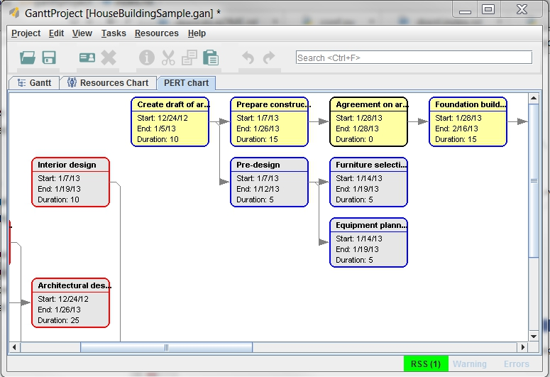

    *pert diagram* viewer - the `house building example`_

`GanttProject`_ also supports `resource allocation models`_. *Resources* can be
attached to *tasks*.The tool generates a resource allocation model
showing the allocation of each resource along the project (see below).

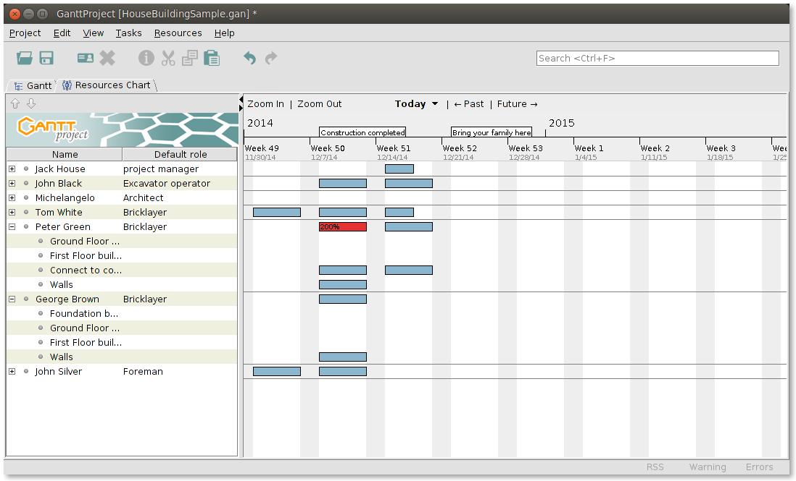

    *resource allocation* viewer - `house building example`_

Interoperability
----------------

Microsoft Project and CSV files can be imported and exported from the
Graphical User Interface (GUI). `GanttProject`_
can also generate PDF, PNG, JPEG.

The tool use an .xml format reasonably simple so interoperability with
other tools is also possible with some development.

The tool also has (a quite limited) Command Line Interface (CLI)
allowing to export models in different formats.

Installation
------------

*   Download the archive |GanttProjectZip|
*   Copy the archive into ``%SCRIBESTOOLS%`` and extract it here.
*   Rename the directory to obtain ``%SCRIBESTOOLS%\GanttProject``.
*   Copy the ``gandttproject.cmd`` into the directory.
*   Add ``%SCRIBESTOOLS%\GanttProject`` to the ``PATH`` variable

Launching GanttProject
----------------------

`GanttProject`_ is mostly used trough its Graphical User Interface (GUI), but
it also has a Command Line Interface (CLI) allowing some limited kind of
automation. In a (new) shell you can type the following command to see the
help about the CLI::

    ganttproject.bat -h

The normal way to use the program is the GUI tough. You can launch it just
clicking on the executable or the shortcut that the installer might have
created.

When launched, one way to see what `GanttProject`_ is all about is to load
`house building example`_. In order to do that use the menu
`` Projects >> Open `` and select the ``HouseBuildingSample.gan`` file in the
installation directory of the tools.

Documentation
-------------

As far as we know there is no document describing `GanttProject`_.
The tool is nevertheless rather easy to use for someone acquainted
with `project management`_ basics. There is a extended demonstration
in the form of a 15' video |ganttDemo|. The `house building example`_
is also a valuable resource for learning how to use `GanttProject`_.

You may also want to have a look at the following *unofficial* documents
created by people outside of the project:

*   "Apprendre Gantt project Ver 2.6" |ganttApprendre| by Lycée du Dauphiné
    DD & JPG. This tutorial, in french, is rather good.

*   "GandttProject Handbook 0.52" |ganttHandbook52| by alexandre thomas.
    This handbook is rather obsolete and do not contains too much
    information.

Example
-------

.. _`house building example`:

`GanttProject`_ is delivered with an example of "house building" project.
This project is store in the ``HouseBuildingSample.gan``
|ganttHouseBuilding| file in the root of the installation directory.

Graphical User Interface
------------------------

This section describes the main panels of the GanttProject_ software.

Project
"""""""

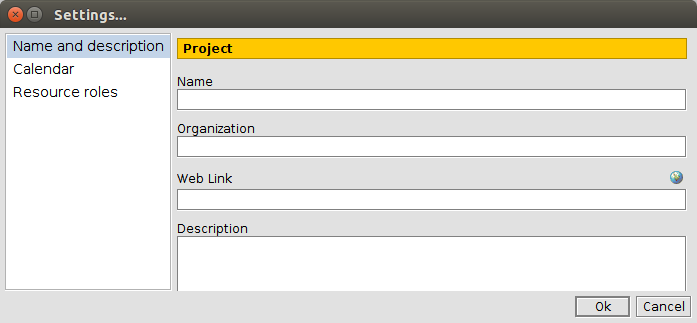

    Project_NameAndDescription

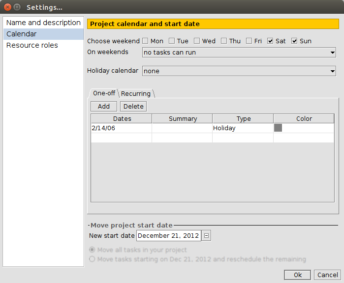

    Project_Calendar

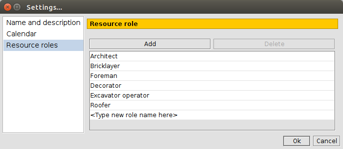

    Project_ResourceRoles

Tasks
"""""

.. figure:: media/Tasks_Hierarchy.png
    :align: center

    Tasks_Hierarchy

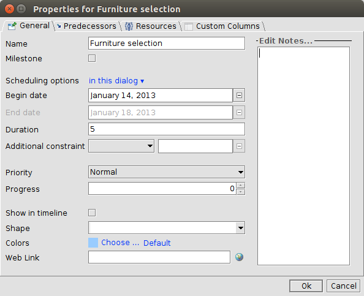

    Tasks_General

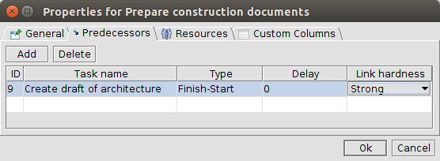

    Tasks_Predecessors

.. figure:: media/Tasks_Resources.png
    :align: center

    Tasks_Resources

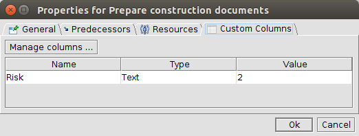

    Tasks_CustomColumns

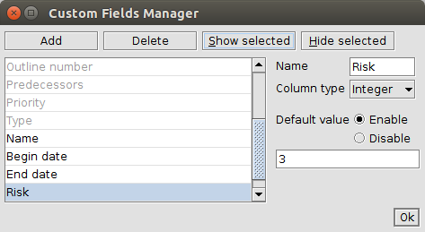

    Tasks_CustomFieldsManager

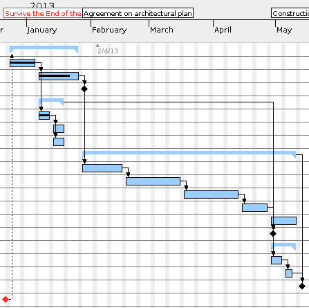

    Tasks_GanttGraph

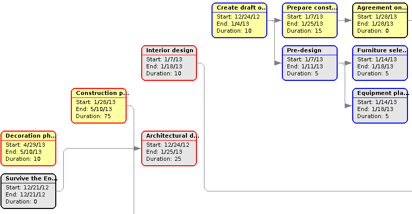

    Tasks_PertGraph

Resources
"""""""""

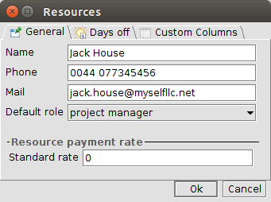

    Resources_General

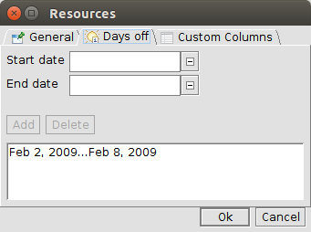

    Resources_DaysOff

.. figure:: media/Resources_CustomColumns.png
    :align: center

    Resources_CustomColumns

.. figure:: media/Resources_CustomFieldsManager.png
    :align: center

    Resources_CustomFieldsManager

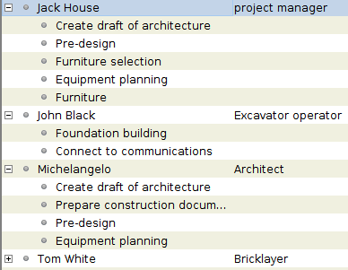

    Resources_TaskList

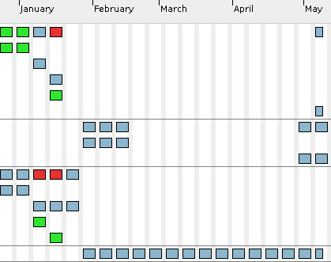

    Resources_TaskAllocation

XML Representation
------------------

Gantt project are saved in ``.gan`` files which are indeed ``xml`` files.
The ``HouseBuildingSample.gan`` file |ganttHouseBuilding| corresponds to the House Building example.

..  literalinclude:: docs/HouseBuildingSample.gan
    :language: xml
    :linenos:

.. .........................................................................

.. |ganttHouseBuilding| replace::
    (:download:`local<docs/HouseBuildingSample.gan>`)

.. |ganttApprendre| replace::
    (:download:`local<docs/apprendre-gantt-project-version-26-vers-17janv2014.pdf>`,
    `web <http://eduscol.education.fr/sti/sites/eduscol.education.fr.sti/files/ressources/pedagogiques/3364/3364-tutoriel-gantt-project-version-26-vers-17janv2014.pdf>`__)

.. |ganttHandbook52| replace::
    (:download:`local<docs/ganttproject-handbook52.pdf>`,
    `web <http://www-mdp.eng.cam.ac.uk/web/CD/engapps/project/ganttprojec.pdf>`__)

.. |ganttDemo| replace::
    (`youtube <https://www.youtube.com/watch?v=5rHCSa5ad34>`__)

.. _`download page`:
    http://www.ganttproject.biz/download.php

.. |GanttProjectZip| replace::
    `web <http://www.ganttproject.biz/download#zip>`__

.. _`installing from zip`: https://code.google.com/p/ganttproject/wiki/InstallingFromZIPArchive

.. _`GanttProject` : http://www.ganttproject.biz/
.. _`project management`: http://en.wikipedia.org/wiki/Project_management
.. _`gantt models`: http://en.wikipedia.org/wiki/Gantt_chart
.. _`pert models`: http://en.wikipedia.org/wiki/Program_evaluation_and_review_technique
.. _`resource allocation models`: http://en.wikipedia.org/wiki/Resource_allocation
