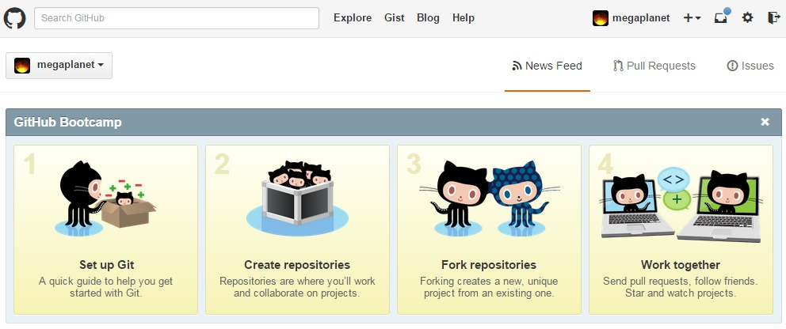
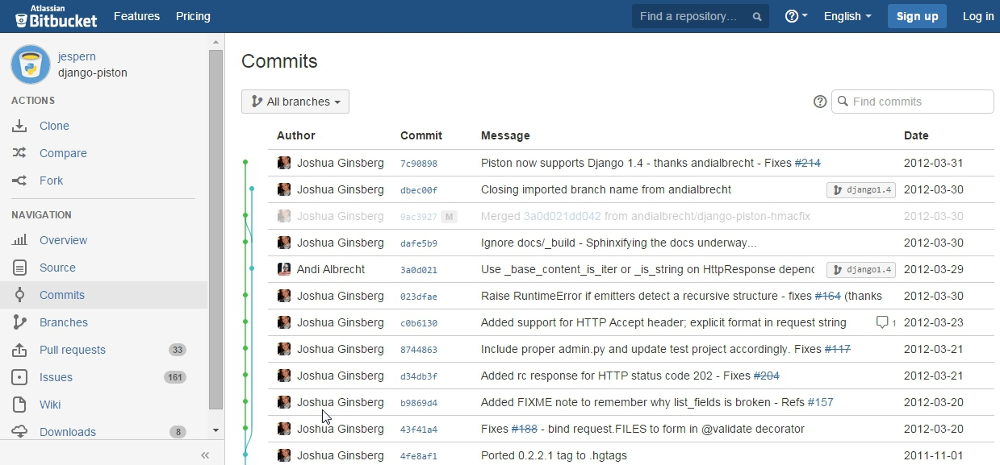
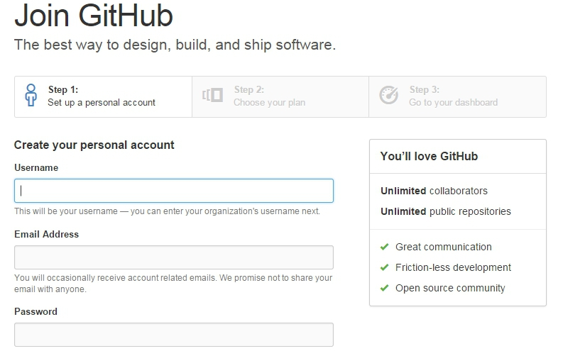
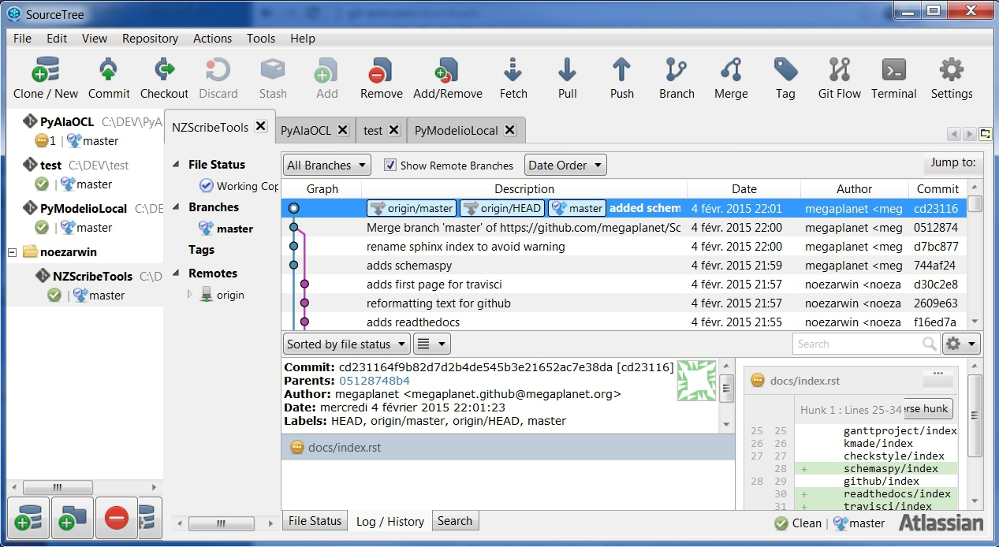
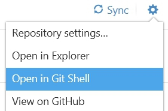

.. _`GitHub chapter`:

Git(Hub)
========

Git_ is one of the most trendy Distributed Versioning Control System (DVCS)
especially in the context of open source projects. GitHub_ and BitBucket_
are very popular hosting services on the cloud.

    GitHub splash screen

Overview
--------

It is important to clearly distinguish right from the beginning Git_ and
GitHub_.
Git_ is a general tool for versioning like SVN_. GitHub is a hosting service
based on Git and also a particular tool (the GitHub client) that can be
installed on your machine.

Git
^^^

Git_ is a toolkit that can be used in a totally standalone mode, that is
locally on any kind of machine (e.g. a laptop running windows/linux/mac).
This is essentially a set of commands that you can run in a shell.

.. figure:: media/gitshell.jpg
    :align: Center

    A shell with a typical git command ``git status``

Git_ can be used both locally by a single developer but also locally and on
the web in a collaborative mode.

* git for local usage.
    One interesting aspect of Git_ is that it is file-based repository:
    installing it do not necessitate to install any kind of server, database;
    no daemon process is required, etc.
    Using git locally is therefore cheap and easy. It will just
    create a `.git` directory in your project directory and that's all. Full stop.
    Git_ can be useful really useful when working alone. This provides you
    some revision control for instance.

* git for collaborative usage.
    Obviously if the goal is to collaborate with others one need a
    *git server*. In this case the local copy of Git_ installed on your machine
    will serve as a *client*. You can setup a git server (if you are in a
    company) or reuse existing services from the cloud.

The next section is about git on the cloud.

GitHub or/and BitBucket
^^^^^^^^^^^^^^^^^^^^^^^

If you need to collaborate with others to develop an open source project,
GitHub_ or BitBucket_ are obvious solutions to consider, at least if you plan
to use Git_. They both provide hosting public git repositories for free.
GitHub and BitBucket have web-based interfaces to explore repositories.

.. figure:: media/github-project.jpg
    :align: Center

    A git repository as shown on github

    A git repository as shown on BitBucket

We highly recommend to use GitHub, unless if you need private repository.
If you want you can have a look at the article `bitbucket vs. github`_ or
to have a look at a more general `comparison of hosting services`_.

Here we will use GitHub since:

* this is the most popular service,
* it provides an excellent *git client* which is amazingly easy to use.

If you need to have a private repository, and want to have that for free,
then you have to use BitBucket for that repository. By contrast to Github
(which offer only public repository), BitBucket provide unlimited private
repositories (will a limit of 5 collaborators including you). The good news
is that tools work with any provider so the solution is most probably:
all public repositories on GitHub, all private repositories on BitBucket.

Installation
------------
In this section you will learn how to:

#. create a github account.
#. install the github client for your machine.
#. install a true 'git' toolkit (only if you need it).

Creating a github account
^^^^^^^^^^^^^^^^^^^^^^^^^
Extremely simple. Just go to https://github.com/join and fill the various
fields. In step 2 select a free plan. Basically this is it.

    Joining GitHub - step 1

Install the github client
^^^^^^^^^^^^^^^^^^^^^^^^^
At the time of writing this documentation, nice github clients exist only for
Windows and for Mac. This step is anyway not obligatory. It install a nice
graphical user interface for using git. This interface is extremely cool,
but if you really want to use only shell commands and have already a git
toolkit installed then you can skip this. If you are on linux you can go to
the next section.

Installation is really simple:

* for Windows just visit https://windows.github.com/ (windows installer
  |GithubClientWindows|).

    .. image:: media/github4windows.jpg

* for Mac just visit https://mac.github.com/ .

    .. image:: media/github4mac.jpg

Install the BitBucket client
^^^^^^^^^^^^^^^^^^^^^^^^^^^^
The github client is really easy to use. However if you want to learn more
about git and want to do some advanced things without the shell, the github
client is not the best choice. In fact, it hides some commands behind some
cool features like 'Sync'. You might prefer another client, for instance the
one proposed on BitBucket. This git client is called SourceTree.

    SourceTree at work

Your can download it from the `SourceTree home page`_. It works on windows
and mac.

Using the git shell
^^^^^^^^^^^^^^^^^^^
The github client installed in the previous sessions include not only a
graphical interface, but also give you access to a git shell where you
can type all commands.

    Launching a git shell from the Windows GitHub client

While the GUI is very nice and enough for most situations, sometimes you
will need to type git commands that are not available in the GUI. In this
case using the git shell is the solution.

Install the git toolkit
^^^^^^^^^^^^^^^^^^^^^^^
In some situations you will however have to install a git toolkit.

.. figure:: media/gitDownload.jpg
    :align: Center

    Git web site.

You have to install git:

* if you have not installed the GitHub client at all (either because you do
  not want or because it is not available on your platform).
* if you want to run some scripts with git commands but you cannot always
  run them from the GitHub shell (e.g. launching them from a cron tab).
* if you use some programs relying on the availability of git commands (those
  program will complain that git commands and not available).

In these case you will have to install git (possibly in addition to github
client). In order to do so, just `download git`_ and install
it following the instructions for your platform (e.g. for windows
|GitWindows|).

On Ubuntu you can install git as following:

    sudo apt-get install git

.. ............................................................................

.. _Git: http://en.wikipedia.org/wiki/Git_%28software%29
.. _GitHub: http://en.wikipedia.org/wiki/GitHub
.. _BitBucket: http://en.wikipedia.org/wiki/BitBucket
.. _`comparison of hosting services` : http://en.wikipedia.org/wiki/Comparison_of_source_code_software_hosting_facilities
.. _`bitbucket vs. github`: http://www.infoworld.com/article/2611771/application-development/bitbucket-vs--github--which-project-host-has-the-most-.html
.. _`download git`: http://git-scm.com/downloads
.. _SVN: http://en.wikipedia.org/wiki/Apache_Subversion
.. _`SourceTree home page`: https://www.atlassian.com/software/sourcetree

.. |GithubClientWindows| replace::
    (:download:`local<../../res/github/downloads/Win/GitHubSetup.exe>`,
    `web <https://github-windows.s3.amazonaws.com/GitHubSetup.exe>`__)

.. |GitWindows| replace::
    (:download:`local<../../res/github/downloads/Win/Git-1.9.5-preview20150319.exe>`,
    `web <https://git-scm.com/download/win>`__)
