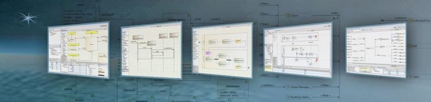
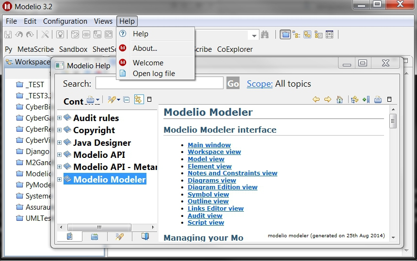
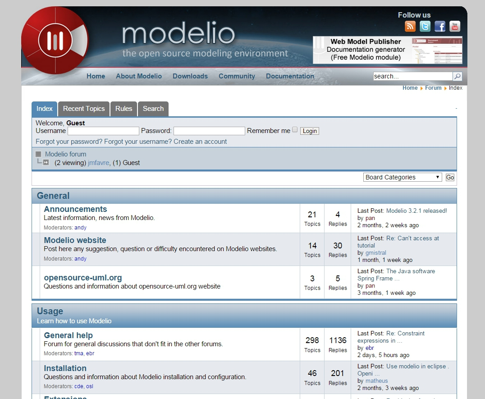
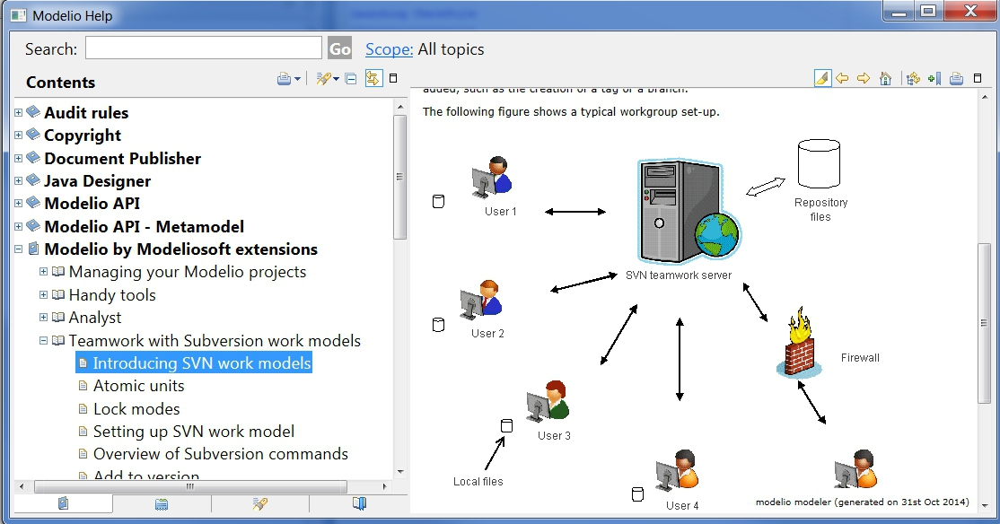
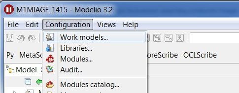
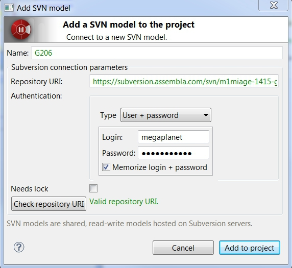
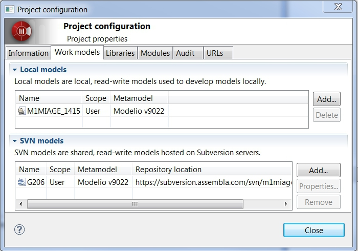

.. _`Modelio chapter`:

Modelio
=======

Modelio_ is an open source modeling environment supporting a wide range of
modeling languages: UML_ and BPMN_ in a native form but also SysML_ or TOGAF_
for example.

Modelio_ is high extensible via `java modules`_ or `python scripts`_ .
Modelio_ runs on Windows, Mac, and Linux.

Features
--------

Modelio if a full-fledged modeling environment supporting:

* model edition and validation for a wide range of modeling languages,
* model distribution over the web,
* model versioning with SVN (commercial edition only),
* documentation generation,
* code generation and or reverse engineering of C++, Java, C#, Hibernate,
  SQL, XSD...

Modelio can be extended to add more features via `java modules`_ or
`python scripts`_.

Installation
------------

Modelio_ exists both in an open source and commercial version. You need a
licence in the later case.

.. tip::
    If you have a licence code you can install both an open source version
    and a commercial version on the same machine. Just use different
    directories such as  ``%SCRIBETOOLS%\ModelioOpen`` and
    ``%SCRIBETOOLS%\ModelioCommercial``.

.. attention::
    The architecture (32bits or 64bits) of your modelio and java installations
    much match.  If this is not the case then launching modelio will likely
    generate a java error exit code 13. If you want to check which architecture
    is used by your java installation open a shell and type ``java -version``.
    If this information is important it will be displayed on the 3rd line.

Installing modelio open-source
^^^^^^^^^^^^^^^^^^^^^^^^^^^^^^

*   Go to the `modelio.org download center` and select
    the archive for your platform (e.g. windows 64 bits |ModelioWin64|).

*   Copy the archive into the directory that will contain the software
    (e.g. ``%SCRIBETOOLS%\ModelioOpen``).

*   Extract the archive and then rename it into something like
    ``%SCRIBETOOLS%\ModelioOpen`` (you may want later to install the commercial
    version as well or another version).

Installing modelio commercial
^^^^^^^^^^^^^^^^^^^^^^^^^^^^^

.. attention::
    You need either a *node-locked licence* or a *floating licence* to execute
    a commercial version:

    * *node-locked licence* (personal use).
        You may have received a licence code that looks
        like ``3BA5A-AVAT9-RUEJD-WK4LP``. In this case after
        the installation you will have to enter this licence code following
        this procedure |modelio-licence-node|. Beware: a licence code can be used
        only in a single machine and when used on a machine it is *impossible*
        to move to another machine.

    * *floating licence* (with organizations).
        If you are running modelio for the first time in the context of an
        organization (e.g. at UFRIMAG_), Modelio_ may ask you
        to enter the reference of a *licence server* following this procedure
        |modelio-licence-client|. You will have to enter the information of
        the licence server (e.g. at the UFRIMAG_ the host name is
        ``im2ag-ad.e-im2ag.ujf-grenoble.fr`` and the port is ``6200``

* Register to modelio community |modelio-register|. This is free.
    This will allow you to download commercial products but also to
    participate in modelio forums, etc.

* Go to model the *ultimate solution* download space |modelio-ultimate| and
    select the installer for your platform.

Launching Modelio
-----------------
If a shortcut has been created to launch Modelio_ (it depends on your
platform), you just have to click on it. Otherwise you can click on the
executable in the installation directory.

Modelio can be launched within a script or from a shell with a command line
like that (here the installation directory is ``%SCRIBETOOLS%\ModelioOpen\``::

    %SCRIBETOOLS%\ModelioOpen\modelio.exe

It could be wise to create a command to add parameters (or to change the
shortcut on windows) in order to display the console window and run the Modelio_
in debug mode (this allows to have more messages in the console in case of
modelio errors)::

    %SCRIBETOOLS%\ModelioOpen\modelio.exe -mdebug -consoleLog

If you get an error 'exit code 13' it is likely that the java and modelio
architecture (32 bits or 64 bits) do not match.

Documentation
-------------

Documentation on Modelio_ is available from the ``Help > Help`` menu of
Modelio_ as shown below. You will most probably want to use the section
``Modelio Modeler`` if you are just interested in using modelio.

Different kind of documentation is also available on the web:

* |modelio-documentation-user|
* |modelio-documentation-developers| (for developing extensions)
* |modelio-documentation-faq|
* a few |modelio-documentation-tutorials| (including some |modelio-videos|)

.. tip::
    The |modelio-forums| provides also a very valuable source of information!
    Use the "Search" tab if you want to search some information about a given
    topic.

Collaborative Modeling with SVN
-------------------------------
Thanks to the ``TeamworkManager`` module Modelio can store projet ``fragments``
in a remote ``SVN`` repository. ``TeamworkManager``  allows various users to
work on the same model at the same time.

.. warning::
    ``TeamworkManager`` feature is available only in some commercial versions
    of modelio. The ``ultimate edition`` provides this feature.

The documentation to create and use ``SVN`` fragments with ``TeamworkManager``
is available in the menu ``help`` of Modelio (but not on the web). It can be
found in the section  ``Modelio by Modeliosoft extensions > Teamwork`` as
shown in the figure below.

Creating a SVN repository
^^^^^^^^^^^^^^^^^^^^^^^^^
This step is necessary only to create your own reprository. *This is not
necessary if someone give you access to a shared repository*.

To create the SVN directory itself you need to have a SVN server. If you don't
have one, you can use Assembla  which is a free-svn provider on the cloud
(see :ref:`Assembla chapter`).

Connecting to a SVN repository
^^^^^^^^^^^^^^^^^^^^^^^^^^^^^^
Open the project in which you want to add the access to ``SVN``. A project is a
set of ``fragments``; there is always one ``local fragment``, the one where you
work. In this section a ``remote fragment`` will be added, the one that
correspond to the ``SVN`` repository.

``Work models`` are the fragments in read/write mode. That is, the fragment
where the developer work. To add the possibility to work on the SVN model
select the menu ``Configuration > Work Models``.

In order to register the SVN repository as a remote work model, click the
``Add`` button in the ``SVN models`` section of the following window:

.. figure:: media/ModelioSVNWorkModels.jpg
    :align: center

In the following form, you can choose a name for the fragment itself. The
URI of the svn repository must be provided as well as the credentials for
accessing it (if required). Checking the URI  with the corresponding button
is a good idea.

A new remote fragment is then available in your project as shown in the window
below.

You should be able to use it and modifying it. The version control commands to use
are mostly:

* update: to get the last updates from the central SVN repository,
* commit: to commit the local changes to the central SVN repository/

.. ............................................................................

.. |modelio-documentation-user| replace::
    `user documentation <https://www.modelio.org/documentation/user-manuals.html>`__

.. |modelio-documentation-developers| replace::
    `developer documentation <https://www.modelio.org/documentation/developer-api.html>`__

.. |modelio-documentation-faq| replace::
    `FAQ <https://www.modelio.org/documentation/faq-menu.html>`__

.. |modelio-documentation-tutorials| replace::
    `tutorials <https://www.modelio.org/documentation/tutorials.html>`__

.. |modelio-videos| replace::
    `videos <https://www.youtube.com/user/ModelioCommunity>`__

.. |modelio-forums| replace::
    `forums <https://www.youtube.com/user/ModelioCommunity>`__

.. _`modelio.org download center` :
    https://www.modelio.org/downloads/download-modelio.html

.. |modelio-register| replace::
    (`web <http://www.modeliosoft.com/en/purchase/user-registration.html?page=shop.registration>`__)

.. |modelio-ultimate| replace::
    (`web <http://www.modeliosoft.com/en/download/ultimate-solution.html>`__)

.. |modelio-licence-node| replace::
    (`web <http://www.modeliosoft.com/licensing/license-activation.html#automatic_activation>`__)

.. |modelio-licence-client| replace::
    (`web <http://www.modeliosoft.com/licensing/license-activation.html#configure_client>`__)

.. |modelio-documentation| replace::
    (`web <http://www.modeliosoft.com/licensing/license-activation.html#configure_client>`__)

.. _Modelio: https://www.modelio.org/

.. _UML: http://en.wikipedia.org/wiki/Unified_Modeling_Language

.. _BPMN: http://en.wikipedia.org/wiki/Business_Process_Model_and_Notation

.. _SysML: http://en.wikipedia.org/wiki/Systems_Modeling_Language

.. _TOGAF: http://en.wikipedia.org/wiki/The_Open_Group_Architecture_Framework

.. _WSDL: http://en.wikipedia.org/wiki/Web_Services_Description_Language

.. _`java modules`: http://www.modeliosoft.com/en/modelio-store/modules.html

.. _`python scripts`: http://www.modeliosoft.com/en/modelio-store/scripts.html

.. _`python plugins`: http://PyModelio.readthedocs.org

.. _UFRIMAG: http://ufrima.imag.fr/

.. |ModelioWin64| replace::
    (:download:`local <../../res/modelio/downloads/Win/modelio-open-201502191121-win32.win32.x86_64.zip>`,
    `web <https://www.modelio.org/modelio-122/doc_download/106-modelio-331-windows-64-bit.html>`__)

