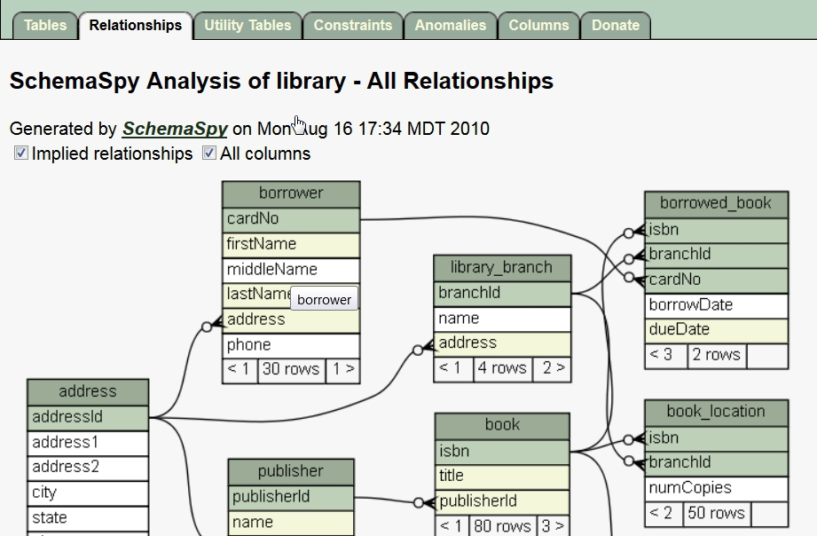

SchemaSpy
=========

SchemaSpy_ is a simple reverse engineering tool that takes a SQL database
and generate diagrams of the database schema. This is a java program; it
runs on all platforms.

Features
--------

SchemaSpy_ reads a relational database and

* generates a XML file corresponding to the database schema
* detects a few kind of defaults in the database design

.. figure:: media/SchemaSpyDefaults.jpg
    :align: center

    Examples of defaults detected by SchemaSpy_

* generates a html site a la javadoc with clickable entity-relationship
  diagrams.

    Example of diagram generated by SchemaSpy_

Interoperability
----------------

SchemaSpy_ is particularly interesting because the reverse engineering process
generates a rather simple XML file so that other tools can be build by
consuming this file.

Installation
------------

To install SchemaSpy_:

* Download the SchemaSpy_ jar file |SchemaSpyJar|.
* Create a directory where to install it (e.g. ``C:\S\SchemaSpy``)
* Move the schemaSpy_5.0.0.jar file to this directory

Launching SchemaSpy
-------------------
You can check if the installation is ok by using the ``-dbhelp`` option of
SchemaSpy_::

    java -jar c:\S\SchemaSpy\schemaSpy_5.0.0.jar -dbhelp

The example above assumes that SchemaSpy_ has been installed in the
``c:\S\SchemaSpy`` directory. This command should display a rather long list of
supported database types, with the option to use to connect to the database
in each case.

You need an access to a SQL database if you want to execute SchemaSpy.
The command line options are described in the documentation.

Documentation
-------------
The documentation is available on the web. It mostly describes the many
possible command line options of SchemaSpy_. There is also an example
of generated html, "`library example`_".

SchemaSpy and sqlite3
---------------------
The sqlite3 driver delivered with SchemaSpy is not working. So if you want to
use explore sqlite3 database, another jdbc driver must be installed. Here we
assume that this was done when installing sqlite3 (see sqlite3 installation
instructions). In the sqlite3 directory you should have a file like
``c:\S\sqlite3\sqlite-jdbc-3.8.10.1.jar``. If this is not the case complete the
sqlite3 installation.

A file named ``sqlite3.properties`` should be created in the SchemaSpy
directory. The content of this file must be as following (do not change
anything except the line after the comment)::

    description=SQLite
    connectionSpec=jdbc:sqlite:<db>
    db=database name
    driver=org.sqlite.JDBC
    # the path to the driver should be adapted
    driverPath=C:\\S\\sqlite3\\sqlite-jdbc-3.8.10.1.jar
    selectTablesSql=.tables

From now on, when you want to use SchemaSpy with a sql database you will have
to specify this property file for all sqlite databases. For instance the
following command line generate the documentation of the database ``db.sqlite3``
in the ``doc\SchemaSpy`` directory::

    java -jar c:\S\SchemaSpy\schemaSpy_5.0.0.jar -t c:\S\SchemaSpy\sqlite3.properties -db db.sqlite3 -sso -o docs\SchemaSpy

.. ............................................................................

.. _SchemaSpy: http://schemaspy.sourceforge.net

.. |SchemaSpyJar| replace::
    (:download:`local <../../res/schemaspy/downloads/schemaSpy_5.0.0.jar>`,
    `web <http://sourceforge.net/projects/schemaspy/files/>`__)

.. _`library example` :  http://schemaspy.sourceforge.net/sample/
