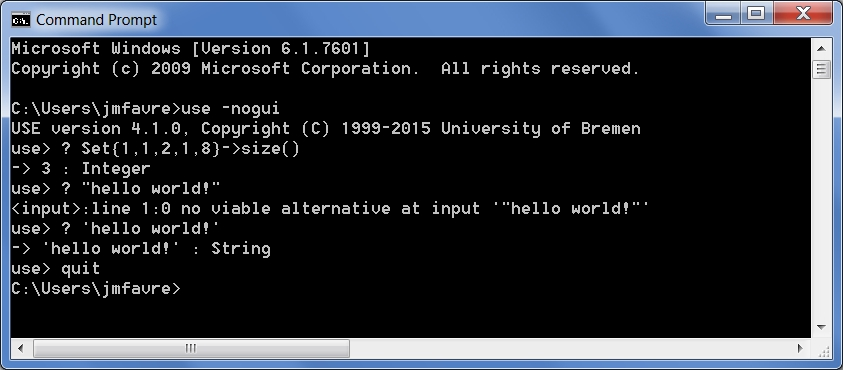

.. _`UseOCL chapter`:

UseOCL
======

"`USE`_ (OCL) is a system for the specification and validation of Information
Systems based on a subset of the Unified Modeling Language (UML) and the
Object Constraint Language (OCL)."

This open source environment has been developed at the University of Bremen and
is available as a `source forge project`_. All the resources available here
have been developed by USE OCL project members under `GPL v2 licence`_

Installation
------------

To install `USE`_ (OCL):

*   download the use zip file (``use-4.1.1.zip`` |use.zip|).
*   extract this zip file where you want to install it (e.g. %SCRIBESTOOLS%
    on windows).
*   rename the newly created directory to ``%SCRIBESTOOLS%\UseOCL``.
*   for convenience add the ``bin`` directory to your system PATH.
    For instance the PATH could look like::

        %SCRIBESTOOLS%\UseOCL\bin; ...   # Windows. ; is the separator
        /home/pablo/UseOCL/bin: ...     # Unix.    : is the separator

.. NOTE::

    On Windows, you can use a OCL language definition for notepad++.
    This will allow you to use this editor with OCL sources "highlighted".

    To install this file:

    * go to "*Main menu > Language > Define your language... > Import ...*\ "
    * select the file ``USE_Notepad_plusplus_User_Defined_Language.xml``
      |use-notepad.xml|.
    * You may have to restart notepad++.

Launching USE OCL
-----------------

Once installed, you can just type the following command in a new shell::

    use -nogui

If the *bin* directory is not in the PATH, then you have type the full
path to use binary). This launch the USE OCL Command Line Interface (CLI).

    A session with the Command Line Interface. Use is started and then some
    OCL expression are evaluated with the ? command.

.. NOTE::   On Windows, if you want to use cygwin, then type ``use.bat -nogui``
            otherwise you may encounter problem with the use script.

.. NOTE::   On Windows, you might see the following warning message that start
            with ``WARNING: Could not ... Software\JavaSoft\Prefs`` and ends
            with ``Windows RegCreateKeyEx(...) returned error code 5.``.
            In this case in administrator mode one should create the key
            ``HKEY_LOCAL_MACHINE\Software\JavaSoft\Prefs`` with ``regedit``.
            This is just a warning and you can use USE OCL safely interactively.
            This might although cause problem if you use USE OCL via
            some scripts as the command will always return an error code.

If you want you can also have a look at the graphical interface (in this case
just type::

    use

.. figure:: media/USEOCL-gui.jpg
    :align: center

    The Graphical User Interface.

Documentation
-------------

There is quite some documentation for USE OCL, but we recommend to read for
instance the following elements in the following order:

1.  Read first the quick tour |use-quick-tour|.
    A MUST READ. A simple class model with 3 classes, 3 associations and
    4 OCL invariants.

2.  Watch the video |use-demo|.
    The first part (until frame 128/208) deals with the static part and
    invariants. The second part deals with dynamics, operation simulation
    and pre/post conditions.
    You may be interested only by the first part or by both parts.

    .. image:: media/USEOCL-video.jpg

3.  Use the reference documentation |use-documentation|.
    Use this document as a reference, for instance to check something about
    USE OCL language. Note that chapter 6 (page 82) contains the list of OCL
    operations supported by OCL USE.

.. note::
    This documentation has not evolved for quite some time. More features have
    been added to USE OCL, in particular to follow the evolution of OCL/UML or
    to remove some limitations. For instance support for qualified associations
    is possible although undocumented. The directory ``examples`` and/or
    ``test`` of the distribution contains some examples demonstrating the use
    of these features. For instance various qualified association examples
    are visible in the ``test/t086.use``.

.. attention::
    The documentation and the video show both the Command Line Interface (CLI)
    and the Graphical User Interface (GUI). You might be however interested
    only by the CLI (in particular in the context of automation and
    integration with other tools). In this case, use the following option when
    launching USE OCL::

        use -nogui

Examples
--------

Various examples of use specifications are available in the distribution
|use.zip| in particular in the directory ``examples``.

The file ``README.examples`` |use-readme-examples| provides an interesting
index that show which OCL features are used in which files.

.. ...........................................................................

..  |use-readme-examples| replace::
    (:download:`local<docs/README.examples.txt>`)

..  |use.zip| replace::
    (:download:`local<../../res/useocl/downloads/use-4.1.1.zip>`,
    `web <http://sourceforge.net/projects/useocl/files/USE/4.1.0/use-4.1.1.zip/download>`__)

..  |use-notepad.xml| replace::
    (:download:`local<../../res/useocl/downloads/Win/USE_Notepad_plusplus_User_Defined_Language.xml>`,
    `web <http://sourceforge.net/projects/useocl/files/Misc/>`__)

..  |use-quick-tour| replace::
    (:download:`local<docs/use-quick-tour.pdf>`,
    `web <http://www.db.informatik.uni-bremen.de/projects/USE/qt.html>`__)

..  |use-documentation| replace::
    (:download:`local<docs/use-documentation.pdf>`,
    `web <http://www.db.informatik.uni-bremen.de/projects/use/use-documentation.pdf>`__)

..  |use-demo| replace::
    (:download:`local<docs/use-demonstration.swf>`,
    `web <http://sourceforge.net/projects/useocl/>`__)

.. _USE: http://sourceforge.net/projects/useocl/
.. _`source forge project`: http://sourceforge.net/projects/useocl/
.. _`GPL v2 licence`: http://www.gnu.org/licenses/gpl-2.0.html
