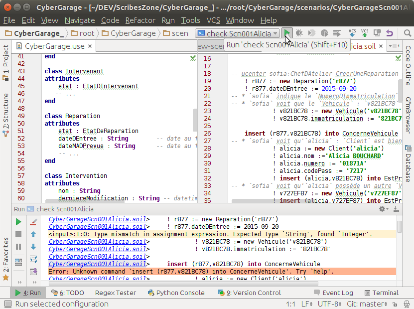

.. _`UseOCL chapter`:

UseOCL
======

"`USE`_ (OCL) is a system for the specification and validation of Information
Systems based on a subset of the Unified Modeling Language (UML) and the
Object Constraint Language (OCL)."

Installation
------------

Installing `USE`_ is rather easy:

*   download the use zip file (``use-4.1.1.zip`` |useZip|).
*   extract this zip file where you want to install it (e.g. %SCRIBESTOOLS%
    on windows).
*   rename the newly created directory to ``%SCRIBESTOOLS%\UseOCL``.
*   for convenience add the ``bin`` directory to your system PATH.
    For instance the PATH could look like::

        %SCRIBESTOOLS%\UseOCL\bin; ...   # Windows. ; is the separator
        /home/pablo/UseOCL/bin: ...     # Unix.    : is the separator

Launching USE OCL
-----------------

Once installed, you can just type the following command in a new shell::

    use -nogui

If the *bin* directory is not in the PATH, then you have type the full
path to use binary). This launch the USE OCL Command Line Interface (CLI).

.. figure:: media/USEOCL-shell.jpg
    :align: center

    A session with the Command Line Interface. Use is started and then some
    OCL expression are evaluated with the ? command.

.. warning::
    On Windows, if you want to use cygwin, then type ``use.bat -nogui``
    otherwise you may encounter problem with the use script.

.. warning::
    On Windows, you might see the following warning message that start
    with ``WARNING: Could not ... Software\JavaSoft\Prefs`` and ends
    with ``Windows RegCreateKeyEx(...) returned error code 5.``.
    In this case in administrator mode one should create the key
    ``HKEY_LOCAL_MACHINE\Software\JavaSoft\Prefs`` with ``regedit``.
    This is just a warning and you can use USE OCL safely interactively.
    This might although cause problems if you use USE OCL via
    some scripts as the command will always return an error code.

.. warning::
    If you get the following warning when starting USE OCL then
    use the option ``-nr``.
    ``java.lang.UnsatisfiedLinkError: no natGNUReadline in java.library.path``

If you want you can also have a look at the graphical interface (in this case
just type::

    use

.. figure:: media/USEOCL-gui.jpg
    :align: center

    The Graphical User Interface.

Documentation
-------------

There is quite some documentation for USE OCL.
We recommend the following order:

0.  Two "cheat sheets" are provided in one file |umlOclCheatSheet|:

    * On one page, the OCL language is described according to the standard.

        ..  image:: media/OCLCheatSheet.png
            :align: center

    * On the other page, the languages of the USE environment are described:
      (1) the specification language (``.use``) which includes OCL, but also
      (2) the action language (``.soil``).

        ..  image:: media/USECheatSheet.png
            :align: center

1.  The "cheat sheets" just describe the language. To understand how
    USE can be used read first the quick tour |useQuickTour|.
    A MUST READ. A simple class model with 3 classes, 3 associations and
    4 OCL invariants.

2.  Watch then the video |useDemo|.
    The first part (until frame 128/208) deals with the static part and
    invariants. The second part deals with dynamics, operation simulation
    and pre/post conditions.
    You may be interested only by the first part or by both parts.

    .. image:: media/USEOCL-video.jpg

3.  If *necessary* use the reference documentation |useDocumentation|.
    Use this document as a reference, for instance to check something about
    USE OCL language. Note that chapter 6 (page 82) contains the list of OCL
    operations supported by OCL USE.

    .. note::
        This documentation has not evolved for quite some time. More features have
        been added to USE OCL, in particular to follow the evolution of OCL/UML or
        to remove some limitations. For instance support for qualified associations
        is possible although undocumented. Use the cheat sheet for updated information.
        If needed the directory ``examples`` and/or ``test`` of the distribution contains
        also some examples demonstrating the use
        of these features. For instance various qualified association examples
        are visible in the ``test/t086.use``.

.. attention::
    The documentation and the video show both the Command Line Interface (CLI)
    and the Graphical User Interface (GUI). You might be however interested
    only by the CLI (in particular in the context of automation and
    integration with other tools). In this case, use the following option when
    launching USE OCL (don't forget ``-nr`` if you get a warning)::

        use -nogui

Using PyCharm IDE
-----------------

USE specifications are just plain text files. A regular file editor
and a shell are just enough to work with USE.

You may however want to use syntax highlighting with PyCharm
(see :ref:`PyCharm chapter` for installation instructions).
Read also :ref:`Launching PyCharm section`. When you launch PyCharm select
the "project directory", the top directory that contains
all your files including the ``.git`` subdirectory if you use git.

PyCharm has to be configured and this imply to follow *various* steps.
A PyCharm plugin has to be installed and a few configurations files
have to be copied. At the end you will get the following result.

    Using PyCharm for USE syntax and output highlighting

The figure shows the following elements:

*   On the left a ``.use`` specification is "syntax-highlighted".
    This is handy especially if the OCL language is used as they are
    many keywords and operations.

*   On the right a ``.soil`` scenario is "syntax-highlighted".
    This is handy since there is typically a lot of comments in such
    a scenario; the statments are much more visible in this way.

*   On the top bar, a button allows to check the scenario against the
    specification. There is no magic here, this button should be configured.

*   On the bottom window, the output of USE is displayed with colors for
    errors. This is quite handy when the output is large.

The instructions below will allow you to get an environment as shown
in the following picture. If you are just going to se USE OCL only once
don't waste your time. Use a regular editor. Otherwise your might consider
following the procedure below.

USE and SOIL highlighting
"""""""""""""""""""""""""""
PyCharm support syntax highlighing for many languages but not USE OCL.
The file contains the definition of the language (keywords, comments, etc.).
PyCharm should be stoped. PyCharm, download |UseOCLxml|, and copy this file to
``.PyCharm50/config/filetypes`` (create
the directory ``filetypes`` if it does not exist already).

.. note::

    The ``.PyCharm50`` directory is used for global IDE settings. The number (e.g. ``50``)
    vary according to the version of the product. This directory it is usually located
    in your home directory (not on OS X). See `IDE Settings`_ for more information.

Start PyCharm. From now on, all ``.use``, ``.soil`` and ``.con`` files should be colored.
If you are curious, the |UseOCLxml| file has been produced using PyCharm feature to
define `new file types`_.

Output highlighting
"""""""""""""""""""
To get the **output** of USE OCL colored (to see the errors as shown in the figure above)
three steps should be followed:

1. Installing the Grep Console plugin
2. Installing a configuration suitable for USE OCL
3. Creating a "Run Configuration"

Installing Grep Console
'''''''''''''''''''''''
In PyCharm go to ``File (menu) > Settings (menu) > Plugins (tab) > Browse Repositories (button)``.

.. note::
    If you computer is behind a firewall you have to specify a proxy.
    In this case select ``HTTP Proxy Settings > Manual Proxy Configuration`` and fill
    the parameters. For instance at the UGA you will need to enter: ``HostName`` :
    ``www-cache.ujf-grenoble.fr``, ``Port Number`` : ``3128``

A list of plugins should be displayed. Type ``"Grep"`` in the search field and install
``Grep Console``.

Configuring Grep Console
''''''''''''''''''''''''
The Grep Console plugin allows to associate colors to regular expressions matching program outputs.
Download the |grepConsoleXml| file which defines a configuration suitable for USE outputs.
PyCharm should be stoped. Copy this file into the ``.PyCharm50/config/options`` directory (see above).
Override the existing file with the same name.

Creating a Run Configuration
''''''''''''''''''''''''''''
Environments like PyCharm use ``Run Configuration`` to launch repetitive tasks.
PyCharm should be stopped. Copy the |checkScn001RazamanazXml| configuration in
the directory ``.idea/runConfigurations`` of your project (create the directory
``runConfigurations`` if it does not exist already).
After starting PyCharm and selecting the menu ``Run > Edit the Configuration``
you should see the following configuration:

.. figure:: media/RunConfiguration.png
    :align: center

    The checkScn001Razamanaz configuration parameters

Adjust this configuration where necessary.

At the time of writing this configuration refers to the ScribesInfra repository
which must be clone at the same level.

.. note::

    As an alternative to PyCharm, on Windows, you can use notepad++.
    A syntax file is available for OCL sources although it is not
    updated, do not support .soil files nor output highlighting.

    To install this file:

    * in Notepad++ go to "*Main menu > Language > Define your language... > Import ...*\ "
    * select the file ``USE_Notepad_plusplus_User_Defined_Language.xml``
      |useNotepadXml|.
    * You may have to restart notepad++.

Examples
--------

Various examples of use specifications are available in the distribution
|useZip| in particular in the directory ``examples``.

The file ``README.examples`` |useReadmeExamples| provides an interesting
index that show which OCL features are used in which files.

.. ...........................................................................

.. _`source forge project`: http://sourceforge.net/projects/useocl/

.. _`GPL v2 licence`: http://www.gnu.org/licenses/gpl-2.0.html

.. _USE: http://sourceforge.net/projects/useocl/

.. _`IDE Settings`:
    https://www.jetbrains.com/pycharm/help/project-and-ide-settings.html#d796009e162

.. _`new file types`:
    https://www.jetbrains.com/pycharm/help/new-file-type.html

..  |umlOclCheatSheet| replace::
    (:download:`local<docs/UMLOCL-CheatSheet-14.pdf>`)

..  |useReadmeExamples| replace::
    (:download:`local<docs/README.examples.txt>`)

..  |UseOCLxml| replace::
    (:download:`UseOCL.xml<res/UseOCL.xml>`)

..  |grepConsoleXml| replace::
    (:download:`GrepConsole.xml<res/GrepConsole.xml>`)

..  |checkScn001RazamanazXml| replace::
    (:download:`checkScn001Razamanaz.xml<res/checkScn001Razamanaz.xml>`)

..  |useDocumentation| replace::
    (:download:`local<docs/use-documentation.pdf>`,
    `web <http://www.db.informatik.uni-bremen.de/projects/use/use-documentation.pdf>`__)

..  |useDemo| replace::
    (:download:`local<docs/use-demonstration.swf>`,
    `web <http://sourceforge.net/projects/useocl/>`__)

..  |useQuickTour| replace::
    (:download:`local<docs/use-quick-tour.pdf>`,
    `web <http://www.db.informatik.uni-bremen.de/projects/USE/qt.html>`__)

..  |useZip| replace::
    `web <http://sourceforge.net/projects/useocl/files/USE/4.1.0/use-4.1.1.zip/download/>`__

..  |useNotepadXML| replace::
    `web <http://sourceforge.net/projects/useocl/files/Misc/>`__

