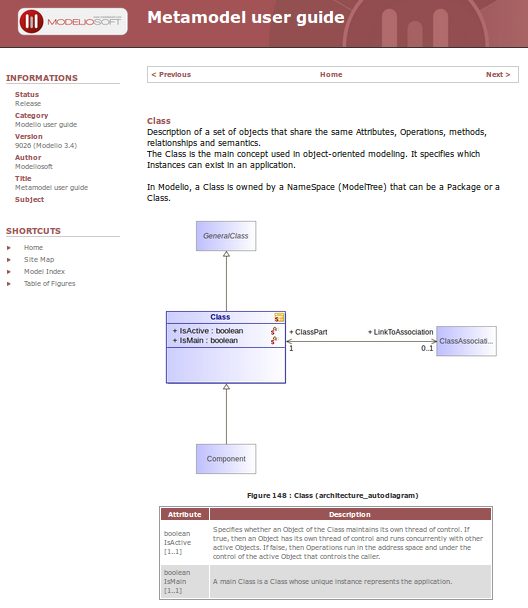
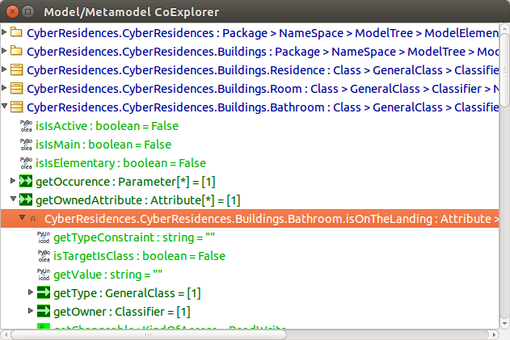
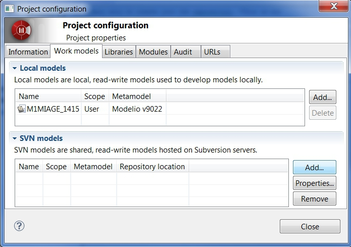

.. _`Modelio chapter`:

Modelio
=======

Modelio_ is an open source modeling environment supporting a wide range of
modeling languages: UML_ and BPMN_ in a native form but also SysML_ or TOGAF_
for example.

.. figure:: media/various-models.jpg

Modelio_ is high extensible via `java modules`_ or `python scripts`_ .
Modelio_ runs on Windows, Mac, and Linux.

Features
--------

Modelio if a full-fledged modeling environment supporting:

* model edition and validation for a wide range of modeling languages,
* model distribution over the web,
* model versioning with SVN (commercial edition only),
* documentation generation,
* code generation and or reverse engineering of C++, Java, C#, Hibernate,
  SQL, XSD...

Modelio can be extended to add more features via `java modules`_ or
`python scripts`_.

Installation
------------

Modelio_ exists both in an open source and commercial version. You need a
licence in the later case.

.. tip::
    If you have a licence code you can install both an open source version
    and a commercial version on the same machine. Just use different
    directories such as  ``%SCRIBESTOOLS%\ModelioOpen`` and
    ``%SCRIBESTOOLS%\ModelioCommercial``.

.. attention::
    The architecture (32bits or 64bits) of your modelio and java installations
    much match.  If this is not the case then launching modelio will likely
    generate a java error exit code 13. If you want to check which architecture
    is used by your java installation open a shell and type ``java -version``.
    If this information is important it will be displayed on the 3rd line.

Installing modelio open-source
^^^^^^^^^^^^^^^^^^^^^^^^^^^^^^

*   Go to the modelio `download center`_ and download
    the archive for your platform.

*   Copy the archive into the directory that will contain the software
    (e.g. ``%SCRIBESTOOLS%\ModelioOpen``).

*   Extract the archive and then rename it into something like
    ``%SCRIBESTOOLS%\ModelioOpen`` (you may want later to install the commercial
    version as well or another version).

Installing modelio commercial
^^^^^^^^^^^^^^^^^^^^^^^^^^^^^

.. attention::
    You need either a *node-locked licence* or a *floating licence* to execute
    a commercial version:

    * *node-locked licence* (personal use).
        You may have received a licence code that looks
        like ``3BA5A-AVAT9-RUEJD-WK4LP``. In this case after
        the installation you will have to enter this licence code following
        this procedure |modelioLicenceNode|. Beware: a licence code can be used
        only in a single machine and when used on a machine it is *impossible*
        to move to another machine.

    * *floating licence* (with organizations).
        If you are running modelio for the first time in the context of an
        organization (e.g. at `UGA`_), Modelio_ may ask you
        to enter the reference of a *licence server* following this procedure
        |modelioLicenceClient|. You will have to enter the information of
        the licence server (e.g. at the `UGA`_ the host name is
        ``152.77.82.15`` and the port is ``6200``

* Register to modelio community |modelioRegister|. This is free.
    This will allow you to download commercial products but also to
    participate in modelio forums, etc.

* Go to model the *ultimate solution* download space |modelioUltimate| and
    select the installer for your platform.

Launching Modelio
-----------------
If a shortcut has been created to launch Modelio_ (it depends on your
platform), you just have to click on it. Otherwise you can click on the
executable (modelio or modelioexe) in the installation directory.

Modelio can be launched within a script or from a shell with a command line
like that (here the installation directory is ``%SCRIBESTOOLS%\ModelioOpen\``)::

    %SCRIBESTOOLS%\ModelioOpen\modelio.exe    # modelio on unix

It could be wise to create a command to add parameters (or to change the
shortcut on windows) in order to display the console window and run the Modelio_
in debug mode (this allows to have more messages in the console in case of
modelio errors)::

    %SCRIBESTOOLS%\ModelioOpen\modelio.exe -mdebug -consoleLog

If you get an error 'exit code 13' it is likely that the java and modelio
architecture (32 bits or 64 bits) do not match.

Note that on the first launch Modelio_ could take quite some time (up to a few
minutes) to start. This could be the case on a slow computer or if your
home directory is on a remote server. Modelio creates the 'module catalog'
and this involves big files. After this, Modelio_ shows a "Welcome" page.
You can simply close it.

.. figure:: media/ModelioWelcome.png

Documentation
-------------

Documentation on Modelio_ is available from the ``Help > Help`` menu of
Modelio_ as shown below. You will most probably want to use the section
``Modelio Modeler`` if you are just interested in using modelio.

.. figure:: media/help.jpg

Different kind of documentation is also available on the web:

* |modelioDocumentationUser|
* |modelioDocumentationDevelopers| (for developing extensions)
* |modelioDocumentationFAQ|
* a few |modelioDocumentationTutorials| (including some |modelioVideos|)

.. tip::
    The |modelioForums| provides also a very valuable source of information!
    Use the "Search" tab if you want to search some information about a given
    topic.

.. figure:: media/forums.jpg

Working with Projects
---------------------
Just like in many software engineering environments Modelio is based
on the notion of "Workspace" (a directory) which contains "Projects"
(subdirectories inside the workspace directory).

Do Not ...
^^^^^^^^^^

The internal structure of "Projects" is entirely managed by Modelio
and must be considered as a black box.

*   **DOT NOT** makes any changes in a project directory.
*   **DOT NOT** put in a DropBox or GoogleDrive in order to share the
    project with someone else. Various problems have been reported in
    the past, probably because of synchronisation processes.
*   **DOT NOT** use git or versioning tools. Models are complex
    artefacts and merging will fail. You might also encounter problems
    if you use git for "backups": git does not save empty directories
    and Modelio use a lot of them...

Project Archives
^^^^^^^^^^^^^^^^
The only safe way to work with modelio is:

* to use the modelio user inteface to make changes during a modeling session,
* to use "project archives" to make project backups or exchange projects.

A "project archive" is a zip file created and managed by Modelio.
**Do not unzip these files**. Use instead "Import" and "Export" functions
of Modelio available in from modelio  `Workspace View`_. In practice these
commands are available *when no project is open*:

* import: menu``File > Import a project``
* export: contextual menu on a project ``Export a project`` (the project
  should be closed).

At the end of a modeling session, it could be wise to "Export the project",
that is save the project in a ``.zip`` file like "MyProject-3.zip". Saving
in it the workspace if fine. Just increment the version number each time to
keep an history of your work. If you want to restore a given version you will just
have to "Import the project" (you may want to save first the current one).

If you want to work with someone else, just send the last version.
Your partner will:

* import the project archive ,
* work on it with modelio,
* make some backups (via exports) if necessary,
* send the last version to you when finished.

If you do not want to guest lost you should increment the version number each
time you save an archive.

Scripting with Modelio
----------------------

This section shows how to extend Modelio_ with its scripting
feature. Jython_ is the scripting language. Jython_ is just
Python running on a Java virtual machine. Otherwise this is
the same programming language. Simply put Jython_ programs
can call all python libraries but also all java libraries...
Modelio is writen in java but Jython_ makes it possible to
use its full API and this without the burden to compile,
package, deploy java plugins.

The first sub section shows how to use Jython_ interactively
in the console. The next section shows how to store scripts
in ``.py`` files to ease development and use regular text
editors or python environments.

Using the console
^^^^^^^^^^^^^^^^^

In this section shows how to use the script console of
Modelio. This is a really excellent feature of Modelio as this
allowed to play interactively with models, explore the metamodel,
experiment with transformations, etc.

*   Open an existing project or create a new one with a few classes
    and attributes. This will make it possible to run the macro below
    on some example.

*   Using the browser on the left, select some classes that contains attributes.

*   Choose the menu ``View > Script``. This open the python engine
    (this takes a few seconds the first time. A Jython_ interpreter is
    loaded).

*  Type the following line in the console and then press ``Ctrl-Enter``:

        .. code-block:: python

            print "Hello World"

*  Observe the result. Try other expressions such as ``print 'a'*3``.

    .. figure:: media/ModelioScriptHelloWorld.png
        :align: center

*  Then copy-paste the following program to the console and press ``Ctrl-Enter``:

        .. code-block:: python

            for c in selectedElements:
                if isinstance(c,Class):
                    attributes = c.ownedAttribute
                    print '<h2> %s <\h2>' % c.name
                    print 'The class %s has %i attributes: <ul>' % (c.name, len(attributes))
                    for a in attributes
                       print '<li> %s : %s </li>' % (a.name, a.type.name )
                    print '</ul>'

*   You might get an error message like the following one (displayed in red)::

        '... line 1 ... SyntaxError: mismatched input '  ' expecting EOF'

    If so this is due to some extra spaces in the copy paste.
    Python is based on the indentation to represent blocks. If
    there are some extra spaces before the first line (``for c in`` ...)
    the interpreter will complain: a top level statement is expected (hence no spaces).

    As you can see, the code  you have just pasted has disappeared
    when you press ``Ctrl-Enter``. This is n really convenient...
    Press the icon that looks like a 'blue gearing' (the penultimate logo
    in the console toolbar). The tooltip on this logo is
    'Activate/Desactivate debug mode'.

    .. figure:: media/ModelioScriptDebugMode.png
            :align: center

    In fact, this mode just allows to keep the text in the console instead
    of erasing it when ``Ctrl-Enter`` is pressed.
    Copy the program above again, check for spaces
    and press ``Ctrl-Enter`` again. Now the program stays in the console.
    If there there are still some space problems you can correct the program there.

*   At some point you will get the following error::

         '... line 6 ... expecting COLON'

    This is because all composed statements (for ... : , if ... :,  etc) must
    have  ``:`` at the end to indicate that a new block is going to start.
    Java programmers often tend to forget this ``:`` and will get this error.
    Otherwise the python syntax is rather straight forward.
    Correct the program by adding ``:`` after ``for a in attributes`` and
    press ``Ctrl-Enter``.

A a little "html generator" has been developed in a few lines of code.
If you select some
classes in modelio browser (on the left pane) and run the program you will
see the list of classes with their attributes in html. Obviously if you want
to see a nice result you should put this in a .html file and launch a browser,
but this is another story (googling something like "python write lines in file"
will probably bring you close to the solution).

Writing code in the console is very convenient for testing code snippets interactively.
However if you want to develop more complex programs and deliver it to other users,
Modelio 'macros' should be used.

Developing macros
^^^^^^^^^^^^^^^^^
Macros are just Jython programs saved in a file. That's all.

The only things to know is where to put these files and where to register it.
Macros can be located in three difference places (but not elsewhere,
this is a current limitation of Modelio):

*   **Project macros**. This location is only useful for macro that are specific
    to a particular projects. Most of the time this is not the case.
    So the project location is seldom used.

*   **Workspace macros**. These macros can be used in all projects within
    this location. *This option is the most convenient and this is the one that
    you are going to use*.

*   **System macros**. These macros are located in your ``.modelio directory``,
    but are normally not for users-defined macros.

Macros are just python files with the ``.py`` prefix. Workspace macros are
stored in the ``macros`` directory of the workspace. In order to make macros
accessible from the Modelio user interface, the macro should be registered in
the 'macro catalog': the XML file named ``macros/.catalog``. As an illustration
the following ``.catalog`` file will register the ``helloworld.py`` macro.

.. code-block:: xml

    <?xml version="1.0" ?>
    <catalog>
        
    </catalog>

There is one ``<script />`` element per macro. Just create the file ``macros\helloworld.py`` as following:

.. code-block:: python

    print 'hello world!'

Modelio should be restarted in order for the macros to be registered.
But don't worry, this should be done only once! It is indeed not very common to
add macros. Restart modelio and open a project (in the workspace containing the
``macros`` directory just modified). A button ``HelloWorld`` should appear
in the toolbar just below Modelio menu bar.
Pressing it will execute the content of the file. The good point is that now
that the macro is registered everything becomes really handy. Use your favorite
editor (notepad++, vi, gedit or a python environment like PyCharm
(see ref:`PyCharm chapter`) and change
the file as you want. Just press again the ``HelloWorld`` button. The code
is executed immediately. No compilation, no packaging, no deployment. Try
to develop plugins written in java for eclipse and you will see the difference...
The benefit of python is right there.

Learning Jython
^^^^^^^^^^^^^^^
Learning Jython is just learning Python as this is actually the same language.
There are plenty of resources available on the web. Just google "python" with
a few terms and you have good chance to get the answer to your question.

To start look at the :ref:`Documentation <Python Documentation>` section of the
:ref:`Python chapter`. You will find some useful cheat sheets. Have also a look
at the slides "J/Python in a Nutshell".

In fact for creating simple macros for Modelio, Jython/Python should not
represent an issue. One just have to know how to write:

* conditional statements: ``if cond:`` ``else:``
* loops ``for e in expr:``
* functions ``def f(x):``

The challenge is in fact to deal with the `Modelio API`_ and in particular
with `Modelio metamodel`_.

Modelio metamodel
-----------------

The `Modelio API`_ is based on `Modelio metamodel`_.
This metamodel integrates in a single metamodel 3 languages:

* UML_ the Unified Modeling language, an international standard.
* BPMN_ the Business Process Modeling Notation, an international standard.
* "Analyst" a modelio proprietary language for requirements engineering.

The metamodel is made of about  `300 metaclasses`_
spread in about 30 packages.

`Modelio metamodel`_ is proprietary. Although is neither compatible with the standard
`UML metamodel`_ nor the standard `BPMN metamodel`_ but it support most of the
features of these languages (in an integrated way).

.. note::

    The metamodel links depend on the version. Adapt the URLs according
    to the version of the UML/Modelio metamodel you use.

The are three ways to explore Modelio metamodel:

* browsing the "metamodel documentation".
* browsing the "API javadoc".
* using the "CoExplorer".

Metamodel documentation
^^^^^^^^^^^^^^^^^^^^^^^

The metamodel is described in the `modelio metamodel documentation`_.
Each metaclass is described in an web page containing a class diagram
centered around the metaclass. See for instance the page for the
`"class" metaclass`_.

    Documentation of the "class" metaclass

Note that the images are clickable. The best way to find a metaclass in this documentation is probably to use
the `metamodel index`_ (and using the "search" feature of the browser).

API javadoc
^^^^^^^^^^^

Using the `modelio API javadoc`_ is another alternative. There are more than
500 classes and 67 packages in this API,but this is because the API provides
many other services. The metamodel is just about "model mangagement".
In other words, all metaclasses are in the javadoc but there are more classes.

Have a look to the `"class" metaclass javadoc`_ and compare it the corresponding
"UML" documentation. As you can see the content is the
same although the javadoc page just reflects that the API is implementated
in java. Naming conventions allows to go from the API to the metamodel seamlessly.

.. figure:: media/ModelioJavadocAPIClass.png
    :align: center

    Javadoc of the "class" metaclass

CoExplorer
^^^^^^^^^^

Another alternative, most probably the most convenient one, is to use the
CoExplorer plugin. This plugin should be installed in order to be used. Select the elements
to be explored in modelio and then press the "CoExplorer" button in the top
right toolbar.

    A session with the CoExplorer plugin.

TODO: to be documented

Collaborative Modeling with SVN
-------------------------------
Thanks to the ``TeamworkManager`` module Modelio can store projet ``fragments``
in a remote ``SVN`` repository. ``TeamworkManager``  allows various users to
work on the same model at the same time.

.. warning::
    ``TeamworkManager`` feature is available only in some commercial versions
    of modelio.  The ``ultimate edition`` provides this feature.
    It is not easy to configure behind a firewall. This section is reserved
    to advanced users only.

The documentation to create and use ``SVN`` fragments with ``TeamworkManager``
is available in the menu ``help`` of Modelio (but not on the web). It can be
found in the section  ``Modelio by Modeliosoft extensions > Teamwork`` as
shown in the figure below.

.. figure:: media/ModelioSvnDocumentation.jpg
    :align: center

Creating a SVN repository
^^^^^^^^^^^^^^^^^^^^^^^^^
This step is necessary only to create your own reprository. *This is not
necessary if someone give you access to a shared repository*.

To create the SVN directory itself you need to have a SVN server. If you don't
have one, you can use Assembla  which is a free-svn provider on the cloud
(see :ref:`Assembla chapter`).

Connecting to a SVN repository
^^^^^^^^^^^^^^^^^^^^^^^^^^^^^^
Open the project in which you want to add the access to ``SVN``. A project is a
set of ``fragments``; there is always one ``local fragment``, the one where you
work. In this section a ``remote fragment`` will be added, the one that
correspond to the ``SVN`` repository.

``Work models`` are the fragments in read/write mode. That is, the fragment
where the developer work. To add the possibility to work on the SVN model
select the menu ``Configuration > Work Models``.

.. figure:: media/ModelioSvnConfigurationMenu.jpg
    :align: center

In order to register the SVN repository as a remote work model, click the
``Add`` button in the ``SVN models`` section of the following window:

In the following form, you can choose a name for the fragment itself. The
URI of the svn repository must be provided as well as the credentials for
accessing it (if required). Checking the URI  with the corresponding button
is a good idea.

.. figure:: media/ModelioSVNLogin.jpg
    :align: center

A new remote fragment is then available in your project as shown in the window
below.

.. figure:: media/ModelionSVNFragment.jpg
    :align: center

You should be able to use it and modifying it. The version control commands to use
are mostly:

* update: to get the last updates from the central SVN repository,
* commit: to commit the local changes to the central SVN repository/

.. ............................................................................

.. |modelioDocumentationUser| replace::
    `user documentation <https://www.modelio.org/documentation/user-manuals.html>`__

.. |modelioDocumentationDevelopers| replace::
    `developer documentation <https://www.modelio.org/documentation/developer-api.html>`__

.. |modelioDocumentationFAQ| replace::
    `FAQ <https://www.modelio.org/documentation/faq-menu.html>`__

.. |modelioDocumentationTutorials| replace::
    `tutorials <https://www.modelio.org/documentation/tutorials.html>`__

.. |modelioVideos| replace::
    `videos <https://www.youtube.com/user/ModelioCommunity>`__

.. |modelioForums| replace::
    `forums <https://www.youtube.com/user/ModelioCommunity>`__

.. _`modelio.org download center` :
    https://www.modelio.org/downloads/download-modelio.html

.. |modelioRegister| replace::
    (`web <http://www.modeliosoft.com/en/purchase/user-registration.html?page=shop.registration>`__)

.. |modelioUltimate| replace::
    (`web <http://www.modeliosoft.com/en/download/ultimate-solution.html>`__)

.. |modelioLicenceNode| replace::
    (`web <http://www.modeliosoft.com/licensing/license-activation.html#automatic_activation>`__)

.. |modelioLicenceClient| replace::
    (`web <http://www.modeliosoft.com/licensing/license-activation.html#configure_client>`__)

.. |modelioDocumentation| replace::
    (`web <http://www.modeliosoft.com/licensing/license-activation.html#configure_client>`__)

.. _`Workspace View`:
    http://forge.modelio.org/projects/modelio3-usermanual-english-340/wiki/Modeler-_modeler_interface_workspace_view

.. _Modelio: https://www.modelio.org/

.. _`modelio metamodel documentation`: `Modelio metamodel`_
.. _`Modelio metamodel`: https://www.modelio.org/documentation/metamodel-3.4/0.html

.. _`300 metaclasses`:
.. _`metamodel index`: https://www.modelio.org/documentation/metamodel-3.4/modelindex.html

.. _`Modelio API` : http://forge.modelio.org/projects/modelio3-moduledevelopersmanuals-api/wiki

.. _
.. _`"class" metaclass` : https://www.modelio.org/documentation/metamodel-3.4/170.html

.. _`download center`: https://www.modelio.org/downloads/download-modelio.html

.. _`modelio API javadoc`: https://www.modelio.org/documentation/javadoc-3.4/index.html

.. _`"class" metaclass javadoc`:
    https://www.modelio.org/documentation/javadoc-3.4/org/modelio/metamodel/uml/statik/Class.html

.. _UML: http://en.wikipedia.org/wiki/Unified_Modeling_Language

.. _`UML metamodel`: http://www.omg.org/spec/UML/2.5/

.. _BPMN: http://en.wikipedia.org/wiki/Business_Process_Model_and_Notation

.. _`BPMN metamodel`: http://www.omg.org/spec/BPMN/Current

.. _SysML: http://en.wikipedia.org/wiki/Systems_Modeling_Language

.. _TOGAF: http://en.wikipedia.org/wiki/The_Open_Group_Architecture_Framework

.. _WSDL: http://en.wikipedia.org/wiki/Web_Services_Description_Language

.. _`java modules`: http://www.modeliosoft.com/en/modelio-store/modules.html

.. _`python scripts`: http://www.modeliosoft.com/en/modelio-store/scripts.html

.. _`python plugins`: http://PyModelio.readthedocs.org

.. _`UGA`: http://ufrima.imag.fr/

.. _Jython: http://www.jython.org/

