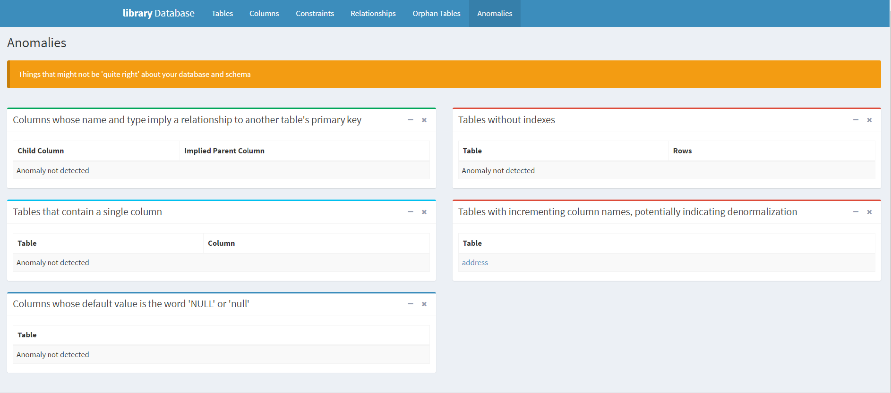

.. _`SchemaSpy chapter`:

SchemaSpy
=========

SchemaSpy_ is a simple reverse engineering tool that takes a SQL database
and generate diagrams of the database schema. This is a java program; it
runs on all platforms.

Features
--------

SchemaSpy_ reads a relational database and

* generates a XML file corresponding to the database schema
* detects a few kind of defaults in the database design

    Examples of defaults detected by SchemaSpy_

* generates a html site a la javadoc with clickable entity-relationship
  diagrams.

.. figure:: media/SchemaSpySchema.png
    :align: center

    Example of diagram generated by SchemaSpy_

Interoperability
----------------

SchemaSpy_ is particularly interesting because the reverse engineering process
generates a rather simple XML file so that other tools can be build by
consuming this file.

Installation
------------

To install SchemaSpy_:

* Download the SchemaSpy_ jar file |SchemaSpyJar|.
* Create the directory ``%SCRIBESTOOLS%\SchemaSpy``.
* Move the ``schemaspy-6.0.0-rc1.jar`` file into ``%SCRIBESTOOLS%\SchemaSpy\schemaSpy.jar``.
* Add ``%SCRIBESTOOLS%\SchemaSpy`` to the system PATH.
* Copy the files ``schemaspy.bat`` and ``schemaspy.sh`` into the directory

Launching SchemaSpy
-------------------
You can check if the installation (in a new shell) by trying the ``-dbhelp``
option::

    schemaspy -dbhelp

This command should display a rather long list of supported database types,
with the option to use to connect to the database in each case.

You need an access to a SQL database if you want to execute SchemaSpy.
The command line options are described in the documentation.

Documentation
-------------
The documentation is available on the web. It mostly describes the many
possible command line options of SchemaSpy_. There is also an example
of generated html, "`library example`_".

SchemaSpy and SQLite
--------------------
The SQLite driver delivered with SchemaSpy is not working. If you want to
use SQLite, a driver and a property file must be installed:

*   make sure that the driver have been installed (see the
    :ref:`SQLite Installation` section of :ref:`SQLite chapter`).
    This results in the driver ``%SCRIBESTOOLS%\SQLite\sqlite-jdbc.jar``.
*   Copy the file ``sqlite.properties`` into the directory
    ``%SCRIBESTOOLS%\SchemaSpy``.
*   Adjust the location of the driver in the ``sqlite.properties`` file.

To use a SQLite database file you will have to specify the path to
the property files with the ``-t`` option: For instance the following command
line generate the documentation of the database ``db.sqlite3``
in the ``docs\SchemaSpy`` directory::

    schemaspy -t %SCRIBESTOOLS%/SchemaSpy/sqlite.properties -db db.sqlite3 -sso -o docs\SchemaSpy

With oracle:

    schemaspy -t orathin -host im2ag-oracle.e.ujf-grenoble.fr -port 1521 -db ufrima -s MYLOGIN -u mylogin -p ***** -o out

.. ............................................................................

.. _SchemaSpy: http://schemaspy.org

.. |SchemaSpyJar| replace::
    `web <https://github.com/schemaspy/schemaspy/releases/>`__

.. _`library example` :  http://schemaspy.org/sample/
